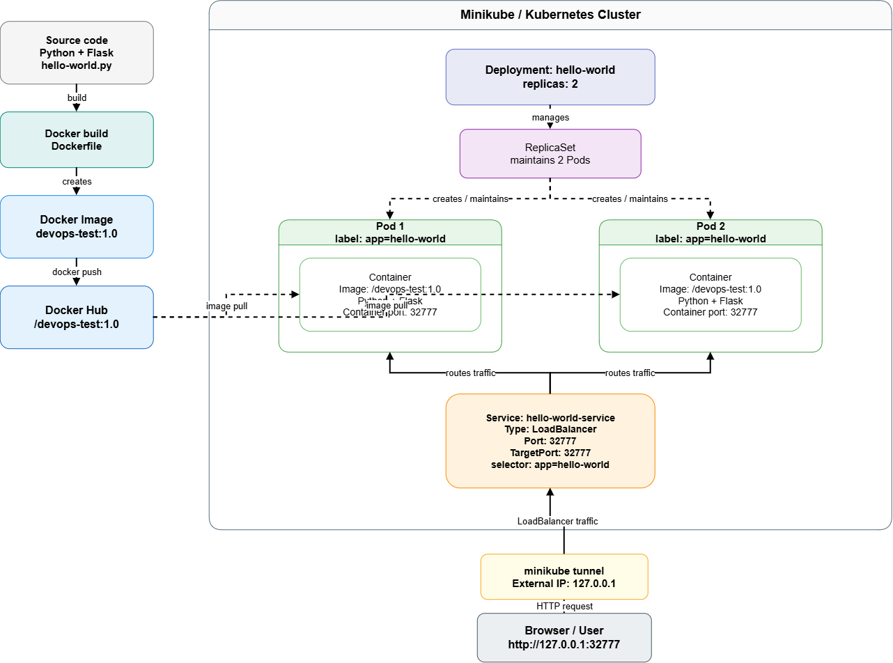
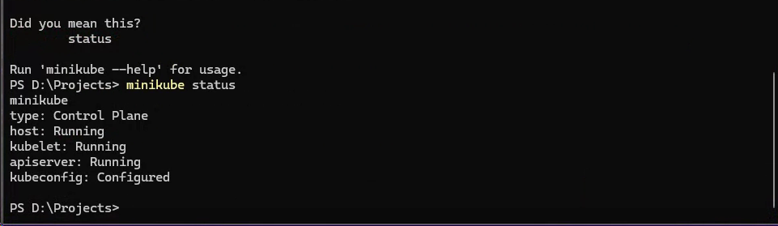
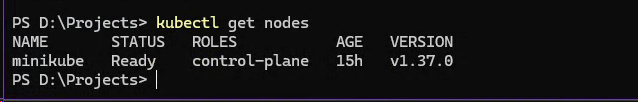
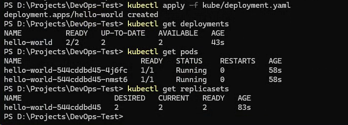
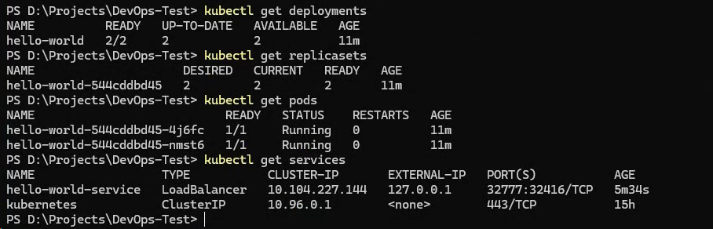
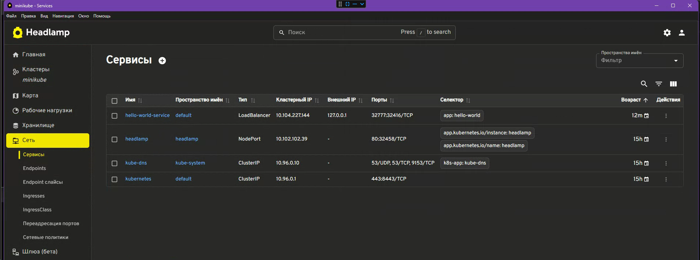
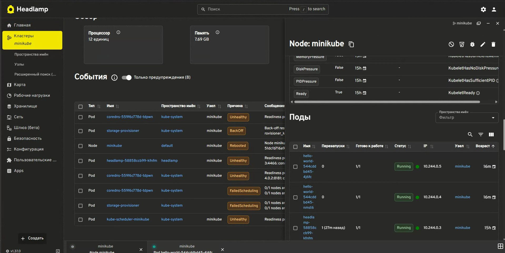
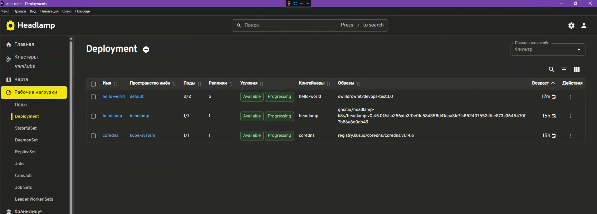
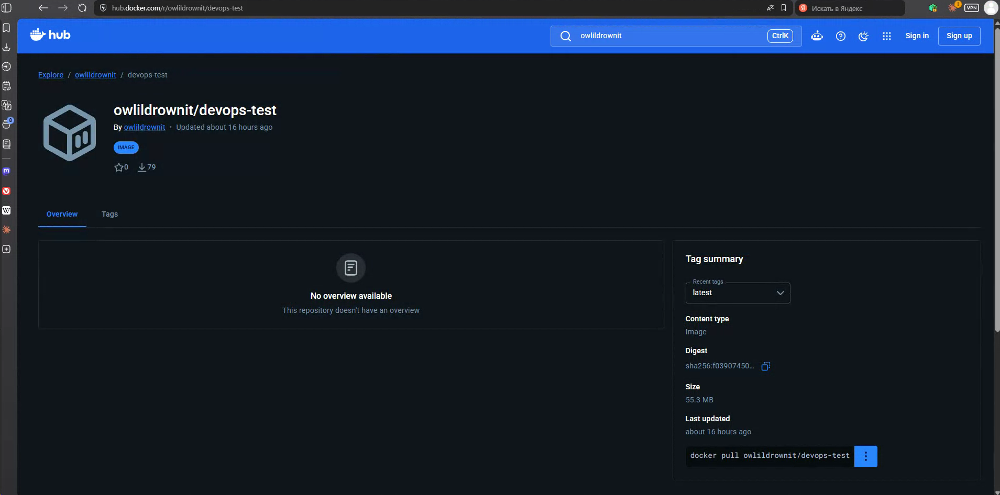

# DevOps Internship Test Task

Тестовое задание на позицию **DevOps Intern**.

В рамках проекта создано простое веб-приложение `Hello World` на Python с использованием Flask. Приложение контейнеризировано с помощью Docker, опубликовано в Docker Hub и развернуто в локальном Kubernetes-кластере Minikube.

Приложение работает на порту `32777`.

---

## Technologies

В проекте используется следующий стек:

- Python
- Flask
- Docker
- Docker Hub
- Kubernetes
- Minikube
- kubectl
- Headlamp
- Git
- draw.io

---

## Архитектура

<p align="center">
  
</p>

[Открыть схему в draw.io](https://app.diagrams.net/#Uhttps%3A%2F%2Fraw.githubusercontent.com%2Fowlildrownit-dev%2FDevOps-Test%2Fmain%2Fdocs%2FScheme.drawio)

[Исходный файл Scheme.drawio](docs/Scheme.drawio)

Deployment поддерживает две реплики приложения.

Каждый Pod содержит отдельный контейнер с Flask-приложением, работающим на порту `32777`.

Service типа `LoadBalancer` выбирает Pod'ы по label:

```text
app=hello-world
```

и перенаправляет входящий трафик на порт `32777` контейнеров.

---

## Архитектура репозитория

```text
DevOps-Test/
│
├── hello-world/
│   ├── hello-world.py
│   └── requirements.txt
│
├── kube/
│   ├── deployment.yaml
│   └── service.yaml
│
├─ docs/
│   ├── Answers.md
│   ├── Scheme.drawio
│   ├── Scheme.png
│   
├── screenshots/
│   ├── deploy.png
│   ├── docker-hub.png
│   ├── general-screen.png
│   ├── HeadLamp.png
│   ├── HeadLamp-deployment.png
│   ├── k8s.png
│   ├── kubernetes_nodes.png
│   ├── minikube_status.png
│   ├── services.png
│   └── system.png
│
├── Dockerfile
├── .dockerignore
├── .gitignore
└── README.md
```

---

# Приложение

Приложение представляет собой минимальный HTTP-сервис на Python/Flask.

При обращении к корневому endpoint:

```text
/
```

приложение возвращает:

```text
Hello World!
```

Приложение слушает:

```text
0.0.0.0:32777
```

Использование `0.0.0.0` позволяет обращаться к приложению не только локально внутри Python-процесса, но и через Docker/Kubernetes networking.

---

# Локальный запуск

## Требования

Для локального запуска необходим Python.

Проверить установленную версию:

```bash
python --version
```

Перейти в директорию приложения:

```bash
cd hello-world
```

Создать виртуальное окружение:

```bash
python -m venv .venv
```

В Windows PowerShell активировать его:

```powershell
.\.venv\Scripts\Activate.ps1
```

Установить зависимости:

```bash
pip install -r requirements.txt
```

Запустить приложение:

```bash
python hello-world.py
```

После запуска приложение будет доступно по адресу:

```text
http://localhost:32777
```

---

# Docker

## Build Image

Сборка Docker image выполняется из корня репозитория:

```bash
docker build -t devops-test:1.0 .
```

Проверить созданный image:

```bash
docker images
```

---

## Run Container

Запустить контейнер:

```bash
docker run --name devops-test-container -p 32777:32777 devops-test:1.0
```

Параметр:

```text
-p 32777:32777
```

пробрасывает порт `32777` хостовой системы на порт `32777` внутри контейнера.

После запуска приложение доступно:

```text
http://localhost:32777
```

Проверить работающий контейнер:

```bash
docker ps
```

---

# Docker Hub

После локальной сборки image был опубликован в Docker Hub.

Docker image:

```text
owlildrownit/devops-test:1.0
```

Docker Hub repository:

```text
https://hub.docker.com/r/owlildrownit/devops-test
```

Перед публикацией локальному image был назначен дополнительный tag:

```bash
docker tag devops-test:1.0 owlildrownit/devops-test:1.0
```

Загрузка image:

```bash
docker push owlildrownit/devops-test:1.0
```

Также может использоваться tag:

```text
latest
```

---

# Kubernetes / Minikube

Для локального Kubernetes-кластера используется Minikube с Docker driver.

## Запуск кластера

Убедиться, что Docker Desktop запущен.

Запустить Minikube:

```bash
minikube start --driver=docker
```

Проверить состояние:

```bash
minikube status
```

Проверить Kubernetes node:

```bash
kubectl get nodes
```

Ожидаемый статус node:

```text
Ready
```

---

# Deployment

Deployment описан в:

```text
kube/deployment.yaml
```

Создание Deployment:

```bash
kubectl apply -f kube/deployment.yaml
```

Проверить Deployment:

```bash
kubectl get deployments
```

Приложение запускается в двух репликах:

```text
READY
2/2
```

Проверить Pod'ы:

```bash
kubectl get pods
```

Ожидается два Pod в состоянии:

```text
Running
```

Также можно посмотреть ReplicaSet:

```bash
kubectl get replicasets
```

Связь ресурсов:

```text
Deployment
    |
    v
ReplicaSet
    |
    +---- Pod 1
    |
    +---- Pod 2
```

Kubernetes постоянно поддерживает желаемое количество реплик.

Если один из Pod удалить:

```bash
kubectl delete pod POD_NAME
```

ReplicaSet автоматически создаст новый Pod, чтобы снова обеспечить:

```text
replicas: 2
```

---

# Service

Service описан в:

```text
kube/service.yaml
```

Создать Service:

```bash
kubectl apply -f kube/service.yaml
```

Проверить:

```bash
kubectl get services
```

Для приложения используется Service типа:

```text
LoadBalancer
```

Основные параметры:

```text
Port:       32777
TargetPort: 32777
Selector:   app=hello-world
```

Service находит Pod'ы по Kubernetes label:

```text
app=hello-world
```

и распределяет трафик между ними.

---

# Minikube Tunnel

Для доступа к Service типа `LoadBalancer` используется:

```bash
minikube tunnel
```

Команда должна оставаться запущенной в отдельном терминале.

После запуска tunnel проверить Service:

```bash
kubectl get services
```

В локальной конфигурации Minikube приложение становится доступно через:

```text
http://127.0.0.1:32777
```

---

# Kubernetes Resource Verification

Для общей проверки состояния приложения можно использовать:

```bash
kubectl get deployments
kubectl get replicasets
kubectl get pods
kubectl get services
```

Проверка конкретного Pod:

```bash
kubectl describe pod POD_NAME
```

Просмотр логов контейнера:

```bash
kubectl logs POD_NAME
```

---

# Headlamp

Для визуального просмотра ресурсов Kubernetes дополнительно использовался Headlamp.

Через Headlamp были дополнительно проверены:

- Minikube cluster
- Node
- Deployment
- Pods
- Service
- состояние реплик
- сетевые параметры

Deployment содержит две рабочие реплики приложения.

---

# Screenshots

## Minikube Status



---

## Kubernetes Node



---

## Deployment and Pods



---

## Kubernetes Resources



---

## Service



---

## Headlamp



---

## Headlamp Deployment



---

## Docker Hub



---

# Ответы на теоретические вопросы

Ответы на теоретическую часть тестового задания находятся в отдельном файле:

[docs/Answers.md](docs/answers.md)

---

# Полезные команды

Запуск Minikube:

```bash
minikube start --driver=docker
```

Проверка состояния:

```bash
minikube status
```

Применение всех Kubernetes правил:

```bash
kubectl apply -f kube/
```

Проверка Pod'ов:

```bash
kubectl get pods
```

Проверка Deployment:

```bash
kubectl get deployments
```

Проверка Service:

```bash
kubectl get services
```

Запуск туннеля:

```bash
minikube tunnel
```

Остановка Minikube:

```bash
minikube stop
```

Удаление локального Minikube-кластера:

```bash
minikube delete
```

---

# Итог

В результате:

- создано Python Flask приложение;
- приложение работает на порту `32777`;
- создан Docker image;
- приложение успешно запускается в Docker container;
- Docker image опубликован в Docker Hub;
- установлен и настроен Minikube;
- создан Kubernetes Deployment;
- Deployment поддерживает две реплики приложения;
- создан Kubernetes Service типа `LoadBalancer`;
- настроен доступ через `minikube tunnel`;
- приложение доступно через браузер;
- состояние Kubernetes-ресурсов проверено через `kubectl` и Headlamp;
- подготовлена архитектурная схема проекта;
- подготовлены скриншоты результатов работы.

